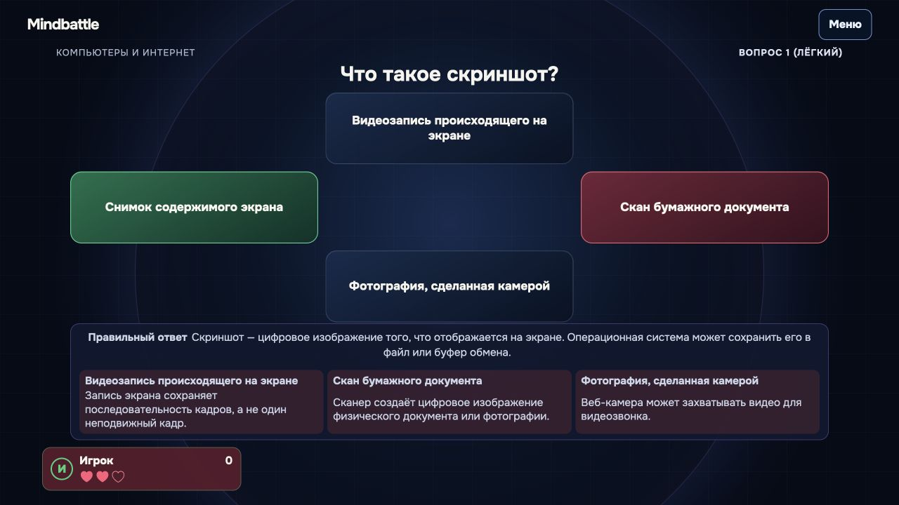
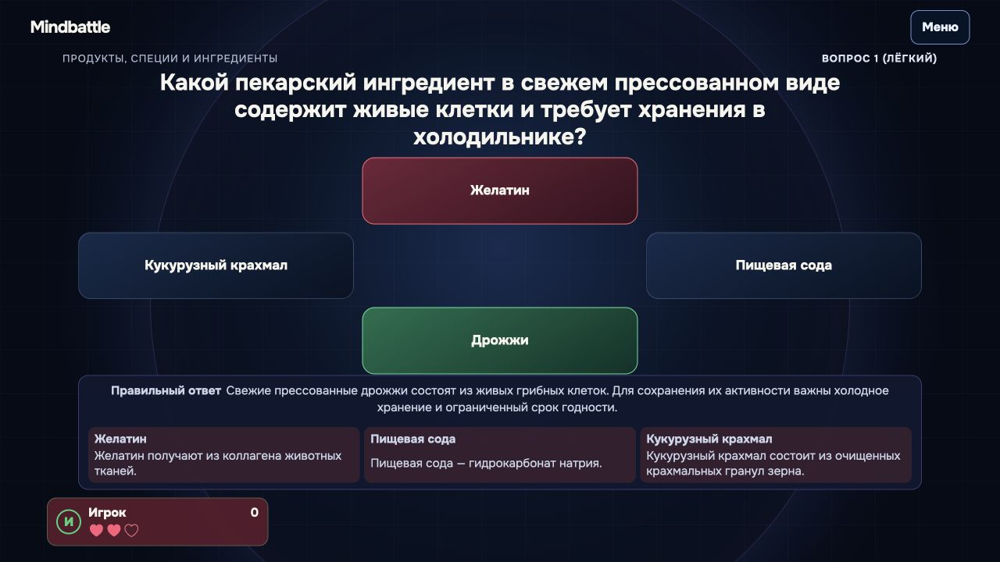
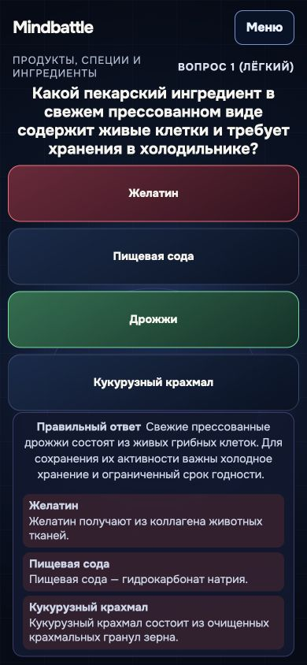
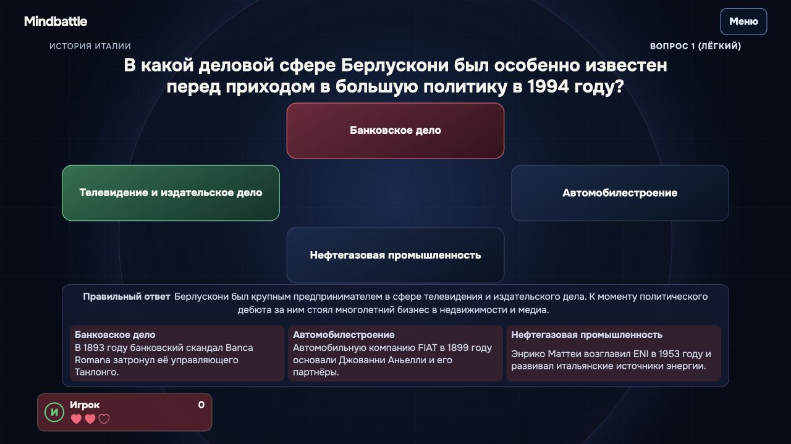
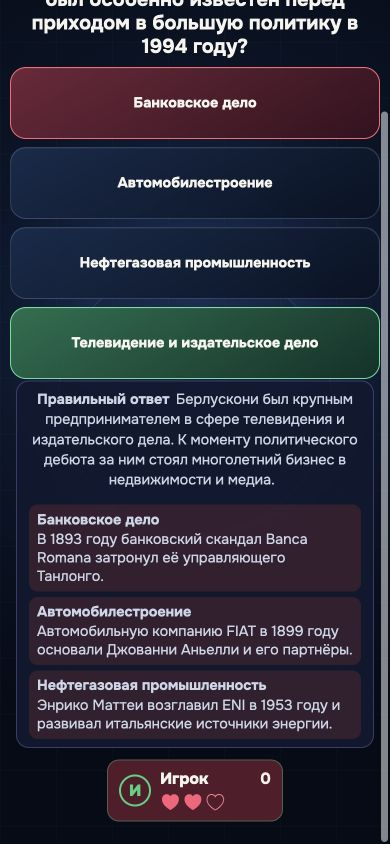
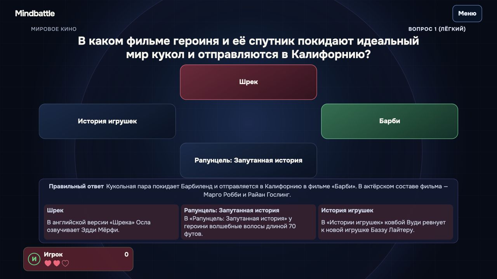
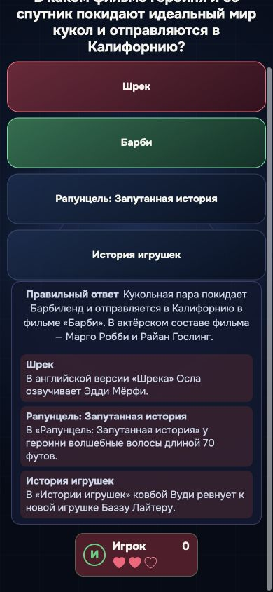
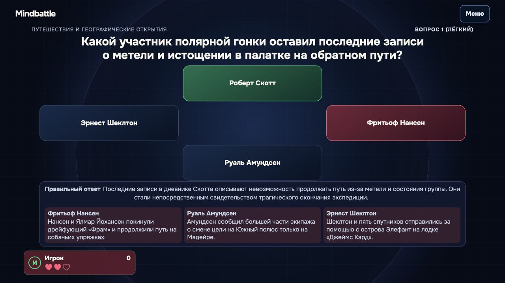

# Реальные снимки встроенного Browser

Пять тем, seed и точные карточки приведены в browser-review.json. Звук и сбор обратной связи выключены через UI. Изображения просмотрены root; explanation и три wrong notes сверены с каталогом.

На 390×844 длинные раскрытия открытий, Италии и кино требуют вертикальной прокрутки. Итоговый мобильный снимок показывает нижнюю часть с тремя справками; верхняя часть сохранена отдельно. Это не приёмка физических устройств.

## computers-internet

### 1280×720

### 390×844

## food-ingredients

### 1280×720

### 390×844

## history-italy

### 1280×720

### 390×844

[Верхняя часть до прокрутки](browser/history-italy-390-top-fold.png)

## world-cinema

### 1280×720

### 390×844

[Верхняя часть до прокрутки](browser/world-cinema-390-top-fold.png)

## world-exploration

### 1280×720

### 390×844

[Верхняя часть до прокрутки](browser/world-exploration-390-top-fold.png)
